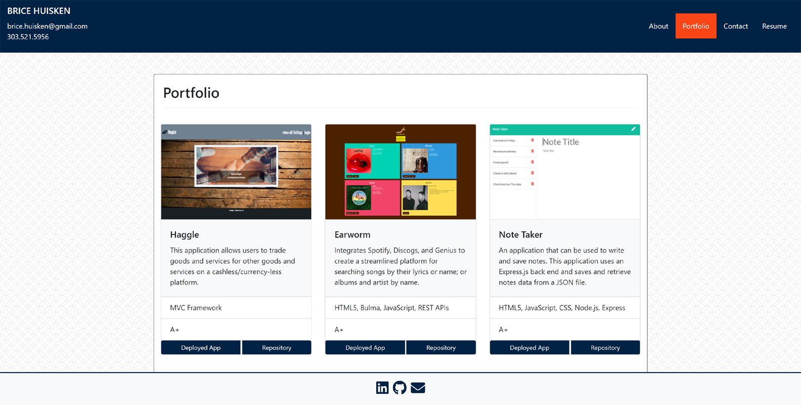
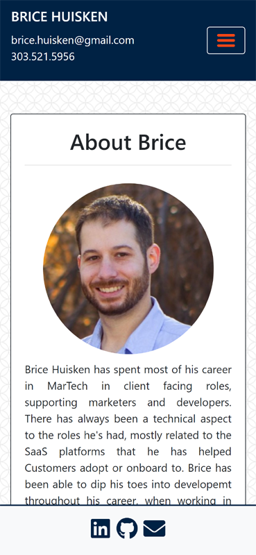

# React Portfolio

## Description

A refactoring of my mobile responsive portfolio site using React. This portfolio contains personalized information (bio, name, images, links to social media, etc.)

## Table of Contents

- [Technolgies](#Technologies-Utilized)
- [Usage](#usage)
- [Credits](#credits)
- [License](#license)

## Technologies-Utilized

- [React.js](https://reactjs.org/)
- [HTML 5](https://developer.mozilla.org/en-US/docs/Web/Guide/HTML/HTML5)
- [JavaScript](https://developer.mozilla.org/en-US/docs/Web/JavaScript)
- [Bootstrap](https://getbootstrap.com/)
- [CSS](https://developer.mozilla.org/en-US/docs/Web/CSS)
- [emailjs](https://www.emailjs.com/)

## Usage

Browse this Portfolio to see the following:

- Portfolio featuring 6 total projects

- Uses React Framework

- A `Header` and component that appears on all pages

- A single `Project` component that will be used multiple times on a single page

- Navigation with React Router, dynamic rendering

- A `Footer` component that appears on all pages

## Deployed Application Link

- [Deployed Link](https://bahuisken.github.io/React-Portfolio/)

## Screenshots

## Credits

- [bahuisken](https://github.com/bahuisken/)
- Lessons from University of Denver Fullstack Coding Bootcamp

## License

None

## Contributing

[Contributor Covenant](https://www.contributor-covenant.org/)

## Tests

N/A

## Questions

If you have any questions about the repo, open an issue or contact me directly at [brice.huisken@gmail.com](mailto:brice.huisken@gmail.com). You can find more of my work at [bahuisken](https://github.com/bahuisken/)
